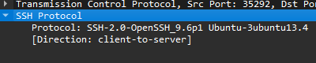
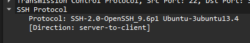
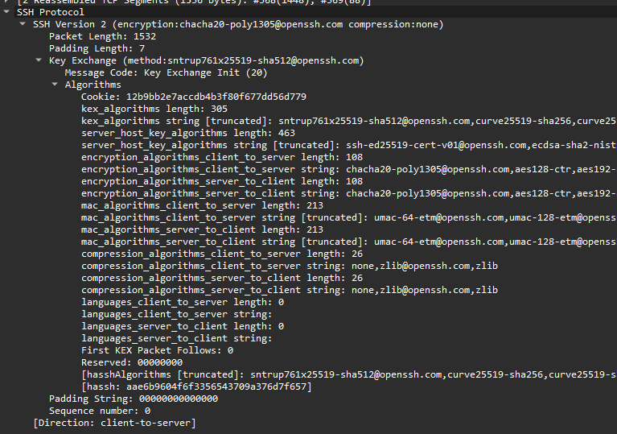
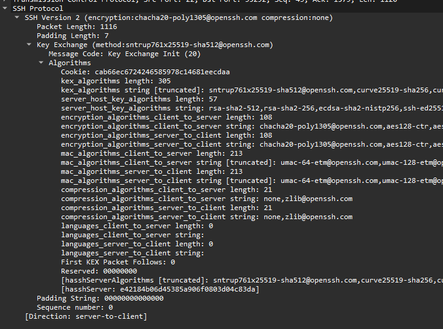
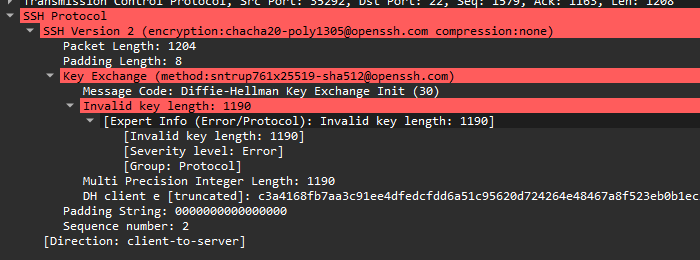
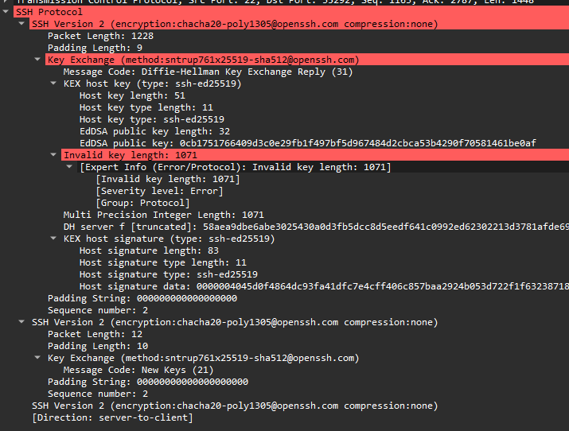
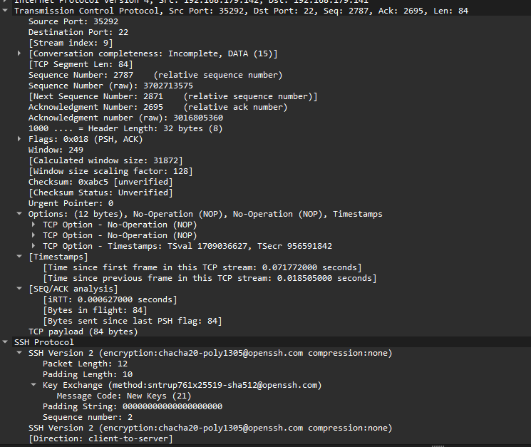

# 1.SSH理论概述

## （1）SSH工作的特点

- 工作在应用层。
- 使用TCP传输协议。
- 密文传输命令，比telent明文传输命令更加安全。
- 只能对与一个应用进行加密。
- 需要双方都有公私钥对。
- 端口22。

## （2）SSH工作的基本框架

### a. 传输层协议

提供服务器认证，数据机密性，信息完整性 等的支持。

### b. 用户认证协议

为服务器提供客户端的身份鉴别。

### c. 连接协议

将加密的信息隧道复用成若干个逻辑通道，提供给更高层的应用协议使用； 各种高层应用协议可以相对地独立于SSH基本体系之外，并依靠这个基本框架，通过连接协议使用SSH的安全机制。

## （3）SSH建立与通信的简单流程
### a. 版本号协商阶段
- 服务器打开端口 22，等待客户端连接。
- 客户端向服务器端发起 TCP初始连接请求，TCP连接建立后，服务器向客户端发送第一个报文，包括版本标志字符串，格式为“SSH－<主协议版本号>.<次协议版本号>－<软件版本号>”，协议版本号由主版本号和次版本号组成，软件版本号主要是为调试使用。
- 客户端收到报文后，解析该数据包，如果服务器端的协议版本号比自己的低，且客户端能支持服务器端的低版本，就使用服务器端的低版本协议号，否则使用自己的协议版本号。
- 客户端回应服务器一个报文，包含了客户端决定使用的协议版本号。服务器比较客户端发来的版本号，决定是否能同客户端一起工作。
- 如果协商成功，则进入密钥和算法协商阶段，否则服务器端断开 TCP连接。
- 版本号协商阶段报文都是采用明文方式传输的。
### b.密钥和算法协商阶段
- 服务器端和客户端分别发送算法协商报文给对端，报文中包含自己支持的公钥算法列表、加密算法列表、MAC（Message Authentication Code，消息验证码）算法列表、压缩算法列表等;
- 服务器端和客户端根据对端和本端支持的算法列表得出最终使用的算法。
- 服务器端和客户端利用 DH交换（Diffie-Hellman Exchange）算法、主机密钥对等参数，生成会话密钥和会话 ID。
- 对于后续传输的数据，两端都会使用会话密钥进行加密和解密，保证了数据传送的安全
- 在认证阶段，两端会使用会话 ID用于认证过程。
-  在协商阶段之前，服务器端已经生成 RSA或 DSA密钥对，他们主要用于参与会话密钥的生成。
### c.认证阶段
- 客户端向服务器端发送认证请求，认证请求中包含用户名、认证方法、与该认证方法相关的内容（如：password认证时，内容为密码）。
- 服务器端对客户端进行认证，如果认证失败，则向客户端发送认证失败消息，其中包含可以再次认证的方法列表。
- 客户端从认证方法列表中选取一种认证方法再次进行认证。
- 该过程反复进行， 直到认证成功或者认证次数达到上限， 服务器关闭连接为止。

#### SSH1认证的方式
-  password认证：客户端向服务器发出 password认证请求，将用户名和密码加密后发送给服务器；服务器将该信息解密后得到用户名和密码的明文，与设备上保存的用户名和密码进行比较，并返回认证成功或失败的消息。
- publickey 认证：采用数字签名的方法来认证客户端。目前，设备上可以利用RSA和 DSA两种公共密钥算法实现数字签名。客户端发送包含用户名、公共密钥和公共密钥算法的 publickey 认证请求给服务器端。服务器对公钥进行合法性检查，如果不合法，则直接发送失败消息；否则，服务器利用数字签名对客户端进行认证，并返回认证成功或失败的消息。
#### SSH2额外的认证方式
- password-publickey 认证：指定该用户的认证方式为 password 和 publickey认证同时满足。客户端版本为 SSH1的用户只要通过其中一种认证即可登录；客户端版本为 SSH2的用户必须两种认证都通过才能登录。
- any认证：指定该用户的认证方式可以是 password，也可以是 publickey。
### d.会话请求阶段
- 服务器等待客户端的请求；
- 认证通过后，客户端向服务器发送会话请求；
- 服务器处理客户端的请求。请求被成功处理后， 服务器会向客户端回应 SSH_SMSG_SUCCESS包，SSH进入交互会话阶段；否则回应 SSH_SMSG_FAILURE包，表示服务器处理请求失败或者不能识别请求。
### e.交互会话阶段
- 在这个模式下，数据被双向传送。
- 客户端将要执行的命令加密后传给服务器;
- 服务器接收到报文，解密后执行该命令,将执行的结果加密发还给客户端;
- 客户端将接收到的结果解密后显示到终端上。

# 2. [SSH实际流程数据包分析](https://blog.csdn.net/m0_49864110/article/details/128500490)

## （1）版本协商

### 客户端发送到服务端的协商

### 服务端返回给客户端的协商

## （2）算法协商

### 客户端到服务端的算法协商

### 服务端到客户端的算法协商

## （3）密钥交换
### 客户端到服务端密钥交换

### 服务端到客户端密钥交换+newkeys

### 客户端到服务端的newkeys

